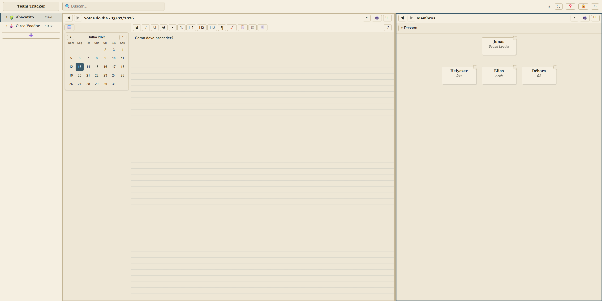

# Team Tracker

A zero-runtime-dependency, single-file web app for tracking teams: people and
hierarchy, daily/per-person notes, action items, milestones (with a calendar
view), and risks.



**[Try it now](https://fmpallini.github.io/team-tracker/)** — runs entirely in
your browser, nothing to install.

## Why

Most team-tracking tools require an account, a server, and your data leaving
your machine. Team Tracker doesn't:

- 🔌 **100% offline** — works without internet; nothing leaves your machine.
- 🗄️ **A single `.tmv` file** you keep wherever you want — copy it, back it up,
  put it in your own cloud sync, put it on a USB stick. There is no vendor
  storing it for you.
- 🔒 **End-to-end encryption (AES-256)** — even if that file sits in a cloud
  backup, it's only ever decrypted on your device, with your password.
- 🪶 **Tiny** — the entire app is a single HTML file under 170 KB
  (as of v1.2), smaller than most web pages' hero image.
- 🖥️ **Desktop-only by design** — built for keyboard and large screens
  (shortcuts, split view, dense panes). Phones and tablets show a notice
  instead of the app: mobile browsers lack the File System Access API the
  open/save flow depends on, so there is no good way to work with your
  `.tmv` file there.

There's no server and no backend. Everything lives in one password-encrypted
`.tmv` file that you open, edit, and save yourself, either straight off disk
(`dist/app.html` via `file://`) or through an installable PWA build
(`dist/pwa/`).

## Why zero runtime dependencies

The app ships as one HTML file with the CSS and JS inlined into it — open it
years from now, on any machine, with any browser, and it still works exactly
as built. That guarantee only holds if nothing at runtime depends on a
third-party library that could have a vulnerability, an abandoned maintainer,
or a breaking major-version bump. `esbuild`, `typescript`, `vitest`, and
`jsdom` are dev-only tooling used to build and test the app — none of their
code ships in `dist/app.html` or `dist/pwa/`. This is a hard project
constraint: no runtime dependency is ever added, however small.

It also means the entire attack surface for supply-chain compromise is
whatever ships in the two build outputs, which you can read end to end — there
is no `node_modules` tree running in the user's browser.

## Using the local file (`app.html`)

Download `app.html` from the
[latest release](https://github.com/fmpallini/team-tracker/releases/latest):
on the release page, expand the **Assets** arrow at the bottom of the release
notes and click `app.html` there — that single file is everything you need
(or build it yourself, see [Build](#build), where it lands in `dist/app.html`).
Just double-click it, or open it from your browser's file picker. No install,
no server, no network access required — the whole app (HTML, CSS, JS) is
inlined into that one file.

To open it in its own app-like window (no address bar/tabs) instead of a
regular browser tab, launch Chrome with the `--app` flag:

```
chrome --app=file:///C:/path/to/dist/app.html
```

(On macOS/Linux, drop the drive letter: `--app=file:///path/to/dist/app.html`.)

## Installable version (PWA)

The same app — always the same version as the `app.html` release asset — is
published at **<https://fmpallini.github.io/team-tracker/>**. Unlike the local
file, it can be installed as a local app (Chrome/Edge show an install prompt;
it opens in its own standalone window), and it **updates automatically**
whenever a new version is released — no re-downloading a release asset by
hand.

## Verifying a release

Every tagged release publishes `checksums.txt` alongside `app.html`, plus a
[GitHub build-provenance attestation](https://docs.github.com/en/actions/security-for-github-actions/using-artifact-attestations/using-artifact-attestations-to-establish-provenance-for-builds)
for `app.html` and every file in the PWA build (`dist/pwa/**`) — cryptographic
proof (Sigstore-backed, not just a checksum) that a given file was built by
this repo's own `Release` GitHub Actions workflow from that exact tagged
commit, not hand-assembled or modified after the fact. You can verify this
yourself instead of taking it on faith:

```
# 1. Download the release assets for the tag you want to verify (example: v1.5.1)
gh release download v1.5.1 -R fmpallini/team-tracker -p "*"

# 2. Confirm app.html matches the published checksum
sha256sum -c checksums.txt

# 3. Verify the build-provenance attestation — requires the GitHub CLI (gh).
#    Confirms the file's hash was attested by the "Attest build provenance"
#    step in this repo's release.yml, tying it to a specific workflow run and
#    source commit.
gh attestation verify team-tracker-1.5.1.html -R fmpallini/team-tracker
```

A successful verify exits with status `0` (silently, in most shells); a
tampered or unrelated file fails with a `404` — there's no matching
attestation for that file's hash. To see exactly which commit the file was
built from, add `--format json` (requires [`jq`](https://jqlang.org/)):

```
gh attestation verify team-tracker-1.5.1.html -R fmpallini/team-tracker --format json \
  | jq -r '.[0].verificationResult.statement.predicate.buildDefinition.resolvedDependencies[0].digest.gitCommit'
```

Compare that SHA against the tag's commit on the
[commits page](https://github.com/fmpallini/team-tracker/commits/main) to
confirm they match.

The PWA build isn't a separate downloadable release asset — it's attested
directly and deployed straight from that same attested build to GitHub Pages,
so you can verify what's actually live by downloading each served file and
checking its attestation directly, no zip needed:

```
for f in index.html sw.js manifest.json; do
  curl -s "https://fmpallini.github.io/team-tracker/$f" -o "live-$f"
  gh attestation verify "live-$f" -R fmpallini/team-tracker
done
```

## Data file

Team Tracker never uploads or syncs your data anywhere. All state lives in a
single encrypted `.tmv` file (password-based encryption) that you create,
open, and save through the app's own file dialogs (or the download-fallback
path in browsers without File System Access API support). **You own the
file and are responsible for backing it up** — losing the file, or forgetting
its password, means the data is unrecoverable. See the next section for the
recommended way to keep it backed up.

## Backing up your team file

Team Tracker has no backup service of its own — and doesn't need one. Keep
your `.tmv` file in a folder synced by any cloud client, such as
[Google Drive for desktop](https://workspace.google.com/products/drive/#download),
OneDrive, or Dropbox, and every save is backed up automatically. This works
the same with the local `app.html` and the installed PWA:

- **Privacy is preserved** — the file is encrypted (AES-256, key derived from
  your password) before it ever touches disk, so the cloud provider — or
  anyone else with access to the cloud account — only ever sees ciphertext.
- **Available anywhere** — download the file from the provider's web UI
  (e.g. drive.google.com) on any machine and open it with the app.
- **Version history for free** — most providers keep previous versions of a
  synced file for a while (Google Drive keeps them for ~30 days), so you can
  also recover an earlier state by downloading an older version of the file.

## Architecture

- **`src/core/`** — headless logic, no DOM construction. Document shape and
  schema migrations (`document.ts`, `types.ts`), the `.tmv` encryption format
  (`crypto.ts`), the mutable document store (`store.ts`), the File System
  Access API wrapper (`fs.ts`), and save orchestration (`save-controller.ts`).
- **`src/modules/`** — one file per feature pane: daily notes, people trees
  (stakeholders/members), person notes, action items, milestones, risks. Each
  module exports a single render function with the signature
  `(container: HTMLElement, loc: Loc, ctx: ModuleCtx) => void` and is wired up
  in `src/main.ts` via `pm.registerModule(kind, renderFn)`.
- **`src/ui/`** — shell, sidebar, pane manager (split view + per-pane
  history), command palette, search, modals, preferences. `ui/dom.ts`'s `el()`
  helper is the one DOM-building primitive used everywhere — no templating
  engine, no virtual DOM.
- **`src/main.ts`** — wires everything together: start screen →
  `onDocumentOpened` builds the shell/store/panes/save-controller, registers
  hotkeys, and sets up cross-tab single-writer locking so only one tab can
  write to a given file at a time.

### Adding a new module/pane

Because every pane is just a render function registered by string key, adding
a new tracked entity (say, a "decisions log", kind `decisions`) is mostly
additive. The one thing that's easy to half-do is wiring it into global search
and the `Ctrl+K` palette — both are covered explicitly below, since they don't
come for free just from registering the module.

1. **Shape and schema.** Add its shape to `Team` (or `Doc`) in
   `src/core/types.ts`, add a `ModuleRef` variant (`{ kind: 'decisions';
   itemId?: string }` — the `itemId?` is only needed if items are individually
   addressable, the way action items/milestones/risks are for deep-linking
   from search and `@`-mentions). Bump `SCHEMA_VERSION` in
   `src/core/document.ts` and add a step to the `MIGRATIONS` ladder there if
   existing `.tmv` files need the field backfilled on open.

2. **The renderer.** Write `src/modules/<name>.ts` exporting a function
   matching `ModuleRenderer` — `(container: HTMLElement, loc: Loc, ctx:
   ModuleCtx) => void`. `ctx` gives you `store`, `pm` (for opening other
   locs), `paneIdx`, `locale`. Read the team via
   `ctx.store.doc.teams.find(...)`, build DOM with `src/ui/dom.ts`'s `el()`
   helper, mutate through `ctx.store.update((d) => { ... })`, and re-render on
   every store change via `ctx.store.subscribe(renderAll)`. Conventions worth
   matching rather than reinventing — look at `src/modules/action-items.ts`
   (no live inputs → full rebuild on every change) or
   `src/modules/milestones.ts` (has inline-editable fields → skips rebuild
   while one is focused, so an in-progress edit's caret survives a foreign
   store change):
   - `store.update()` is for content (marks the doc dirty, fires
     `subscribe()`); `store.updateNav()` is for navigation-only state (pane
     focus, split %) and deliberately bypasses `subscribe()` so switching
     panes doesn't blow away an in-progress edit elsewhere. Don't mix them up.
   - Anything your renderer attaches outside `container` — a document-level
     listener, an overlay appended to `document.body` (see `src/ui/atref.ts`'s
     `@`-mention dropdown) — needs an explicit disposer, tracked in a
     per-container `WeakMap<HTMLElement, () => void>` and called both at the
     top of the renderer (before rebuilding) and from the pane manager's own
     teardown. `panes.ts` clears `container`'s DOM children between renders,
     but has no way to know about listeners/overlays living outside it.

3. **Register it.** In `src/main.ts`, alongside the other
   `pm.registerModule(...)` calls: `pm.registerModule('decisions',
   renderDecisions)`. Do this before the post-registration `pm.renderAll()`
   call a few lines down, or a pane whose saved nav state already points at
   the new kind renders "Módulo em construção…" and never gets a second pass.

4. **Pane switcher + palette (one list, both surfaces).** Add it to
   `FIXED_MODULE_KEYS` in `src/ui/panes.ts`. `buildModuleItems()` in that same
   file turns that list into the `ModuleItem[]` array shown in the pane's own
   "＋" module dropdown — **and `src/ui/palette.ts`'s `Ctrl+K` palette calls
   this exact same function.** There's no separate palette item list to
   maintain; wiring the pane switcher wires the palette too.
   If individual items (not just the module as a whole) should get their own
   palette entries — the way each action item/milestone/risk shows up as its
   own line — extend `buildModuleItems()`'s per-kind branch the way `actions`/
   `milestones`/`risks` do, sourcing the list from `teamRefCandidates()` (step
   6 below — you'll likely want that list anyway).

5. **Global search.** The header search bar (`Ctrl+F` / `/`,
   `src/ui/search-ui.ts`) is backed by `searchDocument()` in
   `src/core/search.ts`, which works over a flat candidate list built by that
   file's `collectCandidates()`. Add a loop over your module's items there:
   ```ts
   for (const d of team.decisions) {
     out.push({ raw: `${d.title}\n${d.rationale}`, title: d.title, ref: { kind: 'decisions', itemId: d.id } })
   }
   ```
   `raw` is whatever free text should be searchable — `searchDocument()`
   strips markdown syntax from it and does a normalized (accent/case
   insensitive), term-by-term substring match; if there's no free-text field,
   `raw` can just equal `title`. Then add an icon to `KIND_ICON` (same file)
   so results render with a matching glyph — that's the only other piece;
   snippet highlighting and the results dropdown are already generic over
   `ref.kind`.

6. **i18n.** Add `pt-BR`/`en-US` strings to `src/core/i18n.ts` — every
   user-visible string goes through `t(locale, key)`, in both locale blocks.

7. **Optional: `@`-mentions.** If notes should be able to `@`-link to one of
   your items, add an entry to the `REF_KINDS` registry in `src/core/refs.ts`
   (drives the mention regex, auto-unlink-on-delete via `unlinkRefsInTeam` —
   call it from your delete path — and the `@`-picker's group header/icon),
   and add the item list to `teamRefCandidates()` in `src/core/search.ts` —
   the same function step 4 mentioned, and what the `@` picker and palette
   both actually filter over.

8. **Tests.** Add `test/<name>.test.ts`. Pure logic gets plain unit tests; the
   renderer gets exercised against a real `createStore(createEmptyDocument(locale))`
   + jsdom the way `test/action-items.test.ts` does — mount, assert on
   `container.querySelector(...)`, dispatch DOM events, assert on the mutated
   `store.doc`.

No other module needs to know the new one exists — the pane manager, sidebar,
and search all work off the registered module list and the `Loc` union. The
two places that genuinely don't come for free are global search
(`collectCandidates`/`KIND_ICON`) and, if wanted, `@`-mentions (`REF_KINDS`) —
everything else (pane switcher, palette, history, print) is generic.

## Build

```
npm install
npm run build
```

This produces:

- `dist/app.html` — a single self-contained HTML file with no external
  references. Copy it anywhere and open it directly.
- `dist/pwa/` — the same app plus `manifest.json`, `sw.js`, and `icon.svg`,
  meant to be served over http(s) so it can be installed as a PWA.

## Development

```
npm test              # run the test suite (vitest)
npx vitest run test/store.test.ts   # run a single test file
npm run test:watch    # vitest watch mode
npm run typecheck     # tsc --noEmit, strict mode
npm run build          # produce dist/app.html and dist/pwa/
```

The codebase has zero runtime dependencies — `esbuild`, `typescript`,
`vitest`, and `jsdom` are dev-only tooling.

## License

AGPL-3.0. See [LICENSE](LICENSE).
