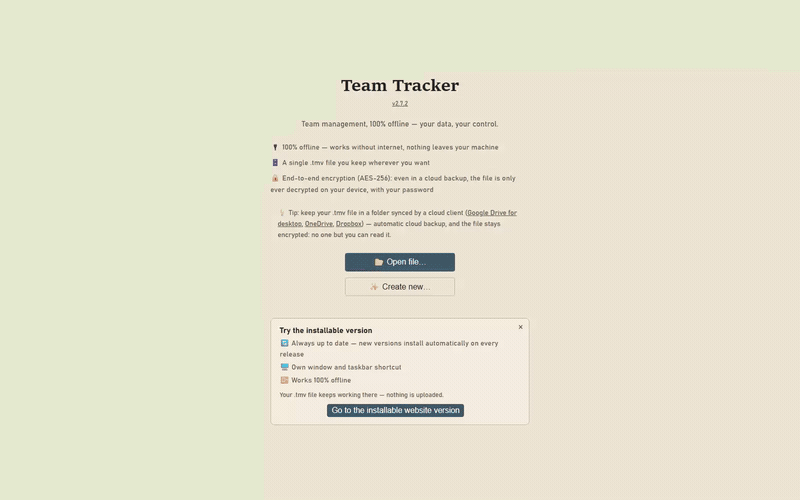
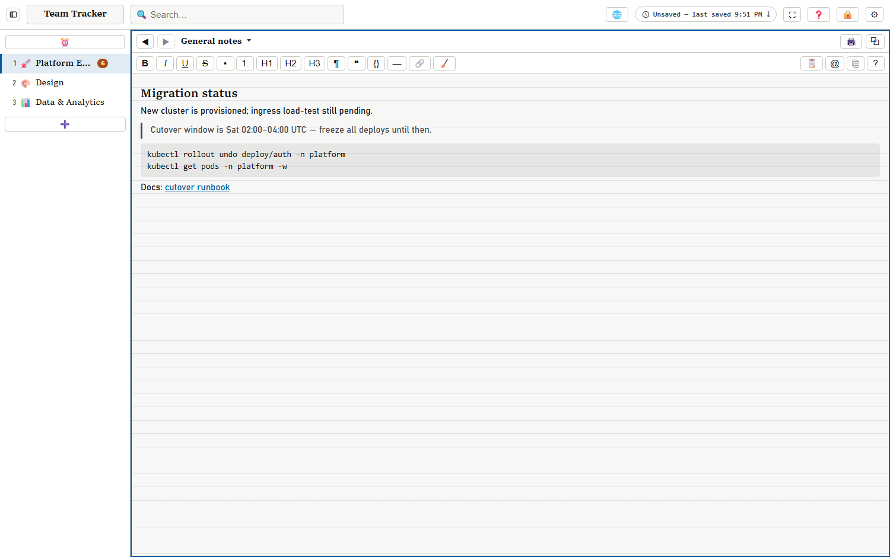
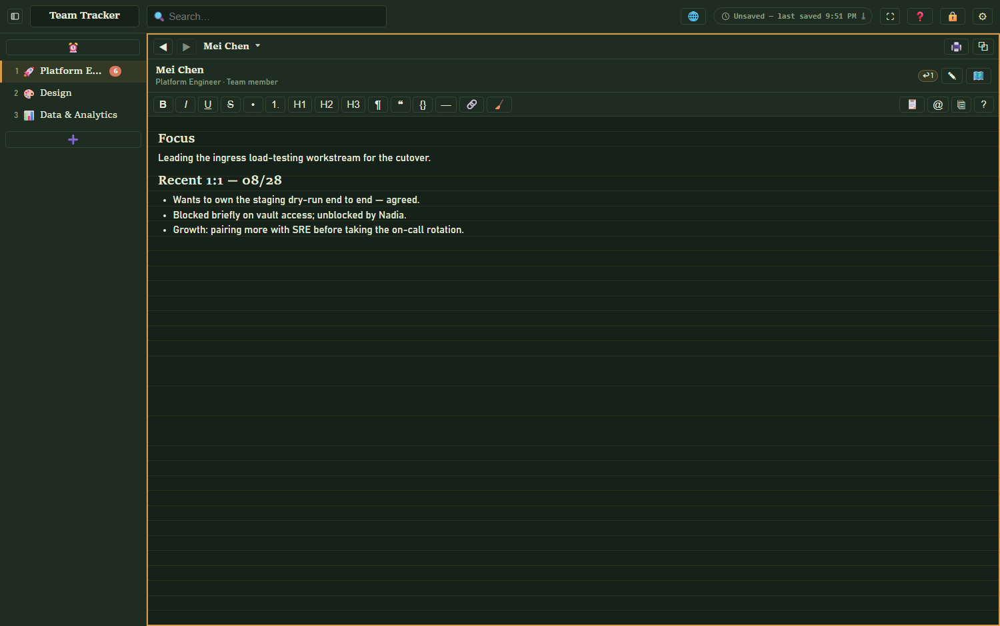

# Team Tracker

A zero-runtime-dependency, single-file web app for tracking teams: people and
hierarchy, daily/per-person notes, action items, milestones (with a calendar
view), and risks.

**[Try it now](https://fmpallini.github.io/team-tracker/)** — runs entirely in
your browser, nothing to install.

### A one-minute tour

Re-organising an org chart by drag and double-clicking a person to open their
notes, rich text (keyboard shortcuts and markdown — headings, quotes, fenced
code, links), collapsing to one wide pane, switching between teams (each fully
separate), Fast Switch (`Ctrl+Shift+K`), `@`-references (one `Ctrl`+click opens
in the second pane, one plain click jumps to the item), one-key templates, a
kanban board with custom columns, dragging a risk on the chance × impact chart
to re-score it, and dark mode.



**[▶ Watch with sound](https://github.com/fmpallini/team-tracker/blob/main/docs/videos/feature-tour-short.webm)**
(GitHub doesn't allow inline `<video>` in a rendered README — the GIF above
is silent; that link opens the same file with GitHub's own video player and
the background music)

<details>
<summary>More screenshots</summary>

| | |
|---|---|
|  |  |
| Daily notes + team hierarchy | Rich text — shortcuts + markdown |
|  |  |
| Action items — kanban with custom columns | Milestones — timeline + list |
|  |  |
| Risks — chance × impact exposure | Per-person notes + backlinks |
|  |  |
| `Ctrl+Shift+K` fast switch | `Ctrl+Shift+F` search across every team |

</details>

## Why

Team Tracker is a free alternative to Notion, Obsidian, or any note-taking
app — free as in price, and free as in freedom: it's AGPL-3.0, and the whole
app is a single HTML file you can read end to end. It deliberately doesn't
try to match those tools feature for feature; it does one thing, tracking
several project teams at once.

Most team-tracking tools require an account, a server, and your data leaving
your machine. Team Tracker doesn't:

- 🔌 **100% offline** — works without internet; nothing leaves your machine.
  The one exception is an optional once-a-day check against GitHub's public
  releases API for a newer version (no data of yours is sent, nothing installs
  automatically) — see [Checking for updates](#checking-for-updates).
- 🗄️ **A single `.tmv` file** you keep wherever you want — copy it, back it up,
  put it in your own cloud sync, put it on a USB stick. There is no vendor
  storing it for you.
- 🔒 **Encryption is the default, and optional** — a `.tmv` file is normally
  AES-256, decrypted only on your device with your password; you can also
  create (or later migrate to) a password-less plain-text file if you'd
  rather skip that overhead, at the cost of anyone with file access being
  able to read it.
- 🪶 **Tiny** — the entire app is a single HTML file, smaller than most
  web pages' hero image alone.
- ⌨️ **Built keyboard-first** — `Ctrl+Shift+K` fast switch, `Ctrl+F` /
  `Ctrl+Shift+F` search, `Alt+1`…`Alt+9` team switching, `Alt+←/→` pane
  history, split-view panes, and a full set of shortcuts for every module —
  the mouse is optional, not required. Desktop-only by design: phones and
  tablets show a notice instead of the app, since mobile browsers lack the
  File System Access API the open/save flow depends on.
- 🎨 **Yours to tune** — 9 color palettes, light/dark/system theme, 5 font
  stacks, adjustable font size, and pt-BR/en-US locales, all in Settings.

There's no server and no backend — you keep the `.tmv` file, opened straight
off disk (`dist/app.html` via `file://`) or through the installable PWA build
(`dist/pwa/`), both covered next.

## Why zero runtime dependencies

The app ships as one HTML file with the CSS and JS inlined into it — open it
years from now, on any machine, with any browser, and it still works exactly
as built. That guarantee only holds if nothing at runtime depends on a
third-party library that could have a vulnerability, an abandoned maintainer,
or a breaking major-version bump. `esbuild`, `typescript`, `vitest`, and
`jsdom` are dev-only tooling used to build and test the app — none of their
code ships in `dist/app.html` or `dist/pwa/`. This is a hard project
constraint: no runtime dependency is ever added, however small.

It also means the entire attack surface for supply-chain compromise is
whatever ships in the two build outputs, which you can read end to end — there
is no `node_modules` tree running in the user's browser.

## Using the local file (`app.html`)

Download `app.html` from the
[latest release](https://github.com/fmpallini/team-tracker/releases/latest):
on the release page, expand the **Assets** arrow at the bottom of the release
notes and click `app.html` there — that single file is everything you need
(or build it yourself — see [CONTRIBUTING.md](CONTRIBUTING.md) — where it
lands in `dist/app.html`).
Just double-click it, or open it from your browser's file picker. No install,
no server required — the whole app (HTML, CSS, JS) is inlined into that one
file. Its only network request is the once-a-day update check (see
[Checking for updates](#checking-for-updates)).

To open it in its own app-like window (no address bar/tabs) instead of a
regular browser tab, launch Chrome with the `--app` flag:

```
chrome --app=file:///C:/path/to/dist/app.html
```

(On macOS/Linux, drop the drive letter: `--app=file:///path/to/dist/app.html`.)

## Installable version (PWA)

The same app — always the same version as the `app.html` release asset — is
published at **<https://fmpallini.github.io/team-tracker/>**. Unlike the local
file, it can be installed as a local app (Chrome/Edge show an install prompt;
it opens in its own standalone window), and it **updates automatically**
whenever a new version is released — no re-downloading a release asset by
hand.

## Checking for updates

This is the one network call the app ever makes, in both build variants:
once a day, it fetches `https://api.github.com/repos/fmpallini/team-tracker/releases/latest`
(a public, unauthenticated read — nothing about you or your data is sent) and
shows a banner if a newer version is out. It's purely informational — the
app never downloads or installs anything by itself; you decide whether to
act on the banner:

- **PWA build**: the banner offers a "Reload now" button that has the
  already-updated service worker take over on reload — no re-download by
  hand.
- **Standalone `app.html`**: a static file:// build can't self-update, so the
  banner instead links to the GitHub releases page for you to download the
  new `app.html` yourself.

Dismissing the banner silences it for that version; there's no preference to
turn the check off entirely.

## Verifying a release

Every tagged release publishes `checksums.txt` alongside `app.html`, plus a
[GitHub build-provenance attestation](https://docs.github.com/en/actions/security-for-github-actions/using-artifact-attestations/using-artifact-attestations-to-establish-provenance-for-builds)
for `app.html` and every file in the PWA build (`dist/pwa/**`) — cryptographic
proof (Sigstore-backed, not just a checksum) that a given file was built by
this repo's own `Release` GitHub Actions workflow from that exact tagged
commit, not hand-assembled or modified after the fact. You can verify this
yourself instead of taking it on faith:

```
# 1. Download the release assets for the tag you want to verify (example: v1.5.1)
gh release download v1.5.1 -R fmpallini/team-tracker -p "*"

# 2. Confirm app.html matches the published checksum
sha256sum -c checksums.txt

# 3. Verify the build-provenance attestation — requires the GitHub CLI (gh).
#    Confirms the file's hash was attested by the "Attest build provenance"
#    step in this repo's release.yml, tying it to a specific workflow run and
#    source commit.
gh attestation verify team-tracker-1.5.1.html -R fmpallini/team-tracker
```

A successful verify exits with status `0` (silently, in most shells); a
tampered or unrelated file fails with a `404` — there's no matching
attestation for that file's hash. Adding `--format json` to the command also
prints the source commit the file was built from, to compare against the
tag on the
[commits page](https://github.com/fmpallini/team-tracker/commits/main).

The PWA build isn't a separate downloadable release asset — it's attested
directly and deployed straight from that same attested build to GitHub Pages,
so you can verify what's actually live by downloading each served file and
checking its attestation directly, no zip needed:

```
for f in index.html sw.js manifest.json; do
  curl -s "https://fmpallini.github.io/team-tracker/$f" -o "live-$f"
  gh attestation verify "live-$f" -R fmpallini/team-tracker
done
```

## Data file

Team Tracker never uploads or syncs your data anywhere. All state lives in a
single `.tmv` file — encrypted by default (see below for password-less) — that
you create, open, and save through the app's own file dialogs (or the
download-fallback path in browsers without File System Access API support).
**You own the file and are responsible for backing it up** — losing the file,
or forgetting its password, means the data is unrecoverable. See the next
section for the recommended way to keep it backed up.

Team Tracker also supports password-less files (chosen at creation, or
Settings → Security → "Migrate to password-less") for when you don't need
encryption — the trade-off is that anyone with file access, including a cloud
provider's automated scanning, can read it as plain text.

## Backing up your team file

Team Tracker has no backup service of its own — and doesn't need one. Keep
your `.tmv` file in a folder synced by any cloud client, such as
[Google Drive for desktop](https://workspace.google.com/products/drive/#download),
OneDrive, or Dropbox, and every save is backed up automatically. This works
the same with the local `app.html` and the installed PWA:

- **Privacy is preserved** — the file is encrypted (AES-256, key derived from
  your password) before it ever touches disk, so the cloud provider — or
  anyone else with access to the cloud account — only ever sees ciphertext.
- **Available anywhere** — download the file from the provider's web UI
  (e.g. drive.google.com) on any machine and open it with the app.
- **Version history for free** — most providers keep previous versions of a
  synced file for a while (Google Drive keeps them for ~30 days), so you can
  also recover an earlier state by downloading an older version of the file.

### Automatic backup file (`.bck`)

As a second, independent line of defense against file corruption (distinct
from a cloud provider's version history, which covers *losing* the file —
this covers the file on disk becoming unreadable), Settings → General offers
"Maintain automatic backup file (.bck)". Once enabled, the app keeps a `.bck`
file — wherever you chose to save it (the picker defaults to the same folder
as the original) — refreshed on your choice of cadence (daily, the default,
or hourly; and always immediately after any password change), containing the
same bytes as the primary file. To recover from it, just rename it from
`.bck` to `.tmv` and open it normally — it uses the exact same format as the
file it was copied from, encrypted or plain.

## FAQ

**Where do notes or action items go if they aren't about one specific team?**
Every module (daily notes, general notes, action items, milestones, risks) is
scoped to a team. If you have org-wide stuff that doesn't belong to any one
team, make a dedicated team for it — e.g. `🌐 General` or `🔗 Cross-team` — and
use that team's General Notes / action items for anything that doesn't fit
elsewhere. The global search bar (`Ctrl+F`) and its all-teams mode
(`Ctrl+Shift+F`) then find it alongside everything else.

**Can I use this for just myself, not an actual "team"?**
Yes. A "team" is just a grouping — one person, one project, one client,
whatever's useful to you. Nothing about the app assumes multiple people.

**How many teams can I have?**
No hard limit. `Alt+1` … `Alt+9` quick-switches the first nine; beyond that,
the sidebar and `Ctrl+Shift+K` fast switch still get you anywhere.

**Can multiple people edit the same file at the same time?**
No — this isn't a real-time collaboration tool. Only one browser tab can hold
write access to a given file at a time (a cross-tab lock enforces this);
opening it elsewhere shows a read-only view with a "take control" option.
Think of it as one manager's tracking tool, not a shared team workspace.

**Can I use it across my phone and laptop?**
Not on the phone — mobile browsers get a blocking screen instead of the app,
since they lack the file APIs the save flow depends on and the UI is
keyboard/desktop-only by design. Across desktops, copy the `.tmv` file
yourself or keep it in a cloud-synced folder (see [Backing up your team
file](#backing-up-your-team-file)) — there's no live sync between devices.

**What happens if I forget my password?**
There's no recovery — the file is encrypted with a key derived from that
password, and nobody (including the app's author) can decrypt it without
it. Use a password manager.

**What if I lose the `.tmv` file itself?**
Team Tracker has no backup service — if the file's gone and you never synced
it anywhere, the data is gone too. See [Backing up your team
file](#backing-up-your-team-file).

**Can I skip the password entirely?**
Yes — "Use without password" at creation, or Settings → Security → "Migrate
to password-less" later (trade-offs in [Data file](#data-file)). You can also
set a password on a password-less file at any time from the same tab.

**What's the `.bck` file next to my `.tmv` file?**
An optional automatic backup, daily or hourly (see [Automatic backup
file](#automatic-backup-file-bck)), enabled per-file in Settings → General.
It's a plain copy of your file at its last backup point — rename it to
`.tmv` to open it like any other file.

**Is there version history or an undo for past edits?**
Not inside the app. Whatever version history your cloud sync provider offers
(e.g. Google Drive keeps ~30 days) is the only way to recover an earlier
state of the file.

**Does any of my data leave my machine — analytics, telemetry, anything?**
No analytics or telemetry, ever. The only network call, in either build, is
the once-a-day version check against GitHub's public releases API (see
[Checking for updates](#checking-for-updates)) — no data of yours is sent,
nothing installs by itself.

**How secure is the `.tmv` file's encryption — could someone brute-force my password?**
The file is AES-256-GCM encrypted with a key derived from your password via
PBKDF2-SHA256 at 600,000 iterations — that iteration count is deliberately
expensive, so guessing passwords against a stolen file is slow even on
dedicated hardware. In practice the real variable is your password's length:
a password of 10+ characters (mixed case/numbers/symbols, not a dictionary
word or reused password) would take a regular computer far longer than a
human lifetime to brute-force. Shorter or common passwords are much weaker —
password strength, not the encryption itself, is the limiting factor. Since
there's no "forgot password" recovery (see above), we strongly recommend
generating and storing the password in a password manager rather than
memorizing something short enough to type easily.

**Can I import an org chart from a CSV or HR system?**
No bulk import. The only import/export feature is team-to-team: exporting a
team's people/hierarchy (no notes, action items, milestones, or risks) so a
teammate can import it and skip re-typing the org chart — see the Data tab
in preferences.

**Does it send reminders or notifications for due dates?**
No push or email notifications — due/overdue items only show up (sidebar
badge, kanban highlighting) while you actually have the app open.

**Is the "clean up" button in preferences safe to click?**
It's irreversible and deliberately cross-team: it permanently deletes every
done/cancelled action item, completed milestone, closed risk, and daily note
older than the day count you set, across **all** teams in the file in one
go. It shows you the exact counts before you confirm — read them first.

## Contributing

- Build & local development — **[CONTRIBUTING.md](CONTRIBUTING.md)**
- How the code is organised — **[docs/ARCHITECTURE.md](docs/ARCHITECTURE.md)**
- Adding a new module/pane — [CONTRIBUTING.md § Adding a new module/pane](CONTRIBUTING.md#adding-a-new-modulepane)

The codebase has zero runtime dependencies (`esbuild`, `typescript`,
`vitest`, `jsdom`, `@playwright/test` are dev-only) — keeping it that way is a
hard rule.

## License

AGPL-3.0. See [LICENSE](LICENSE).
