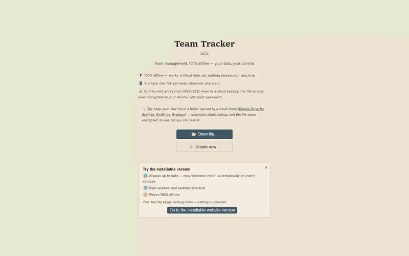
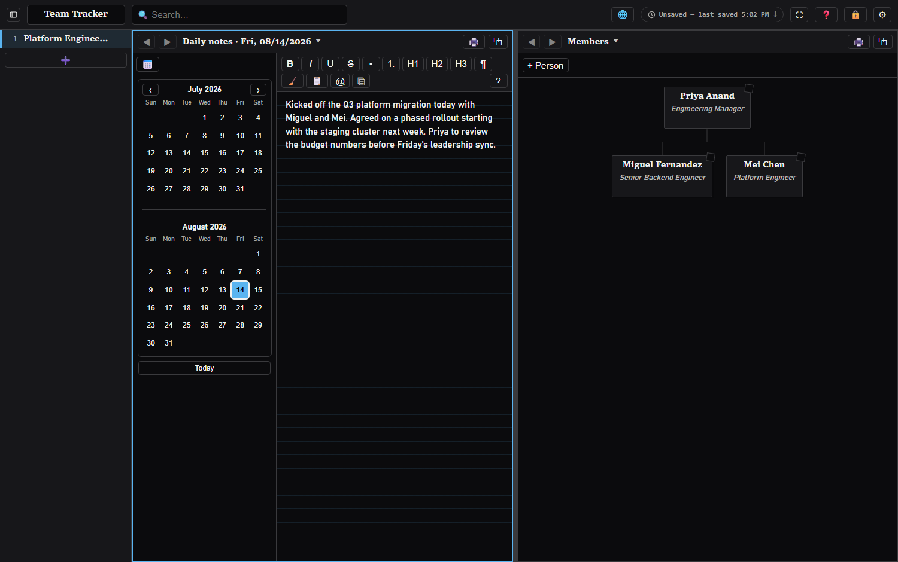
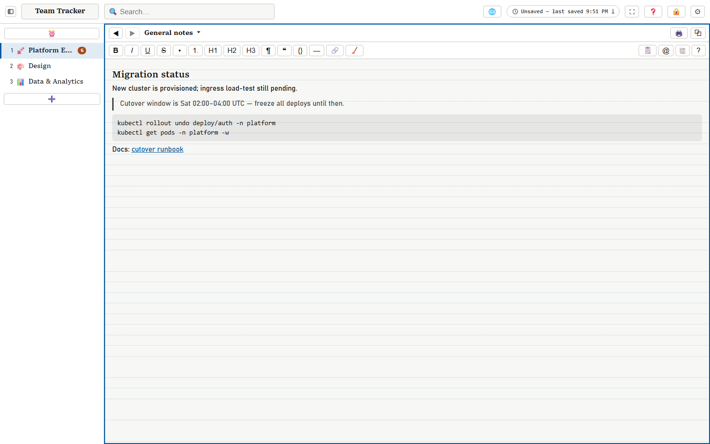
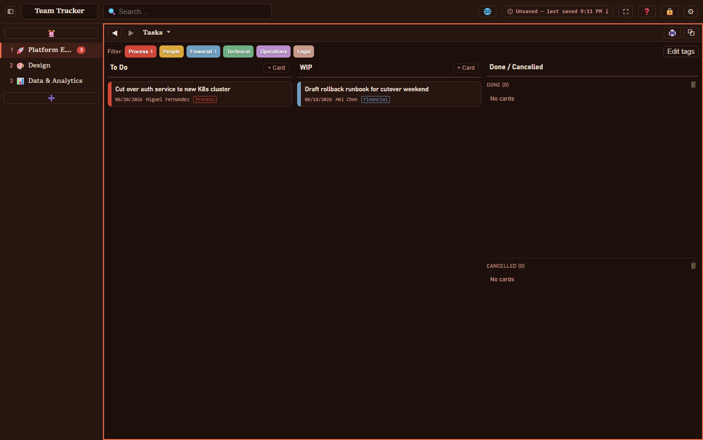
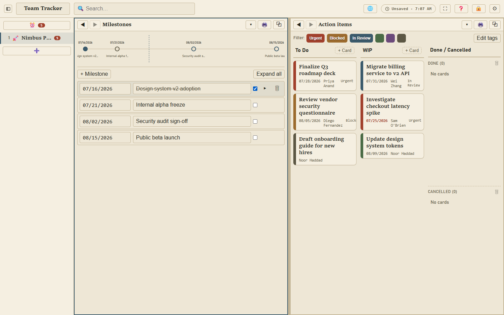
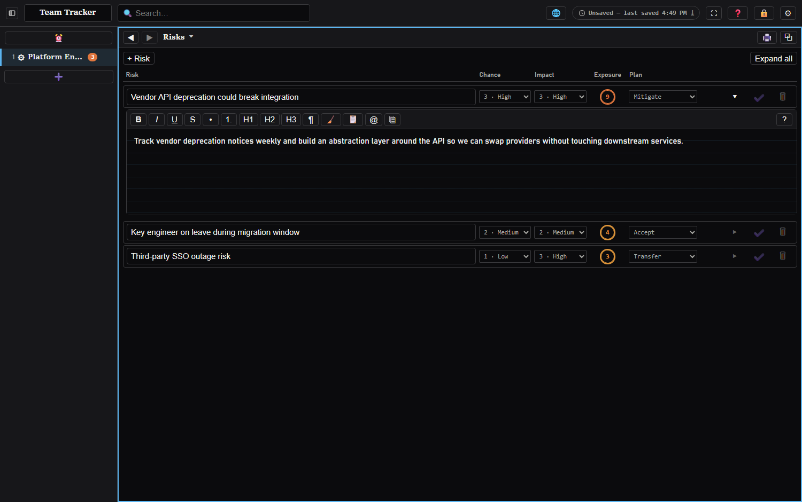
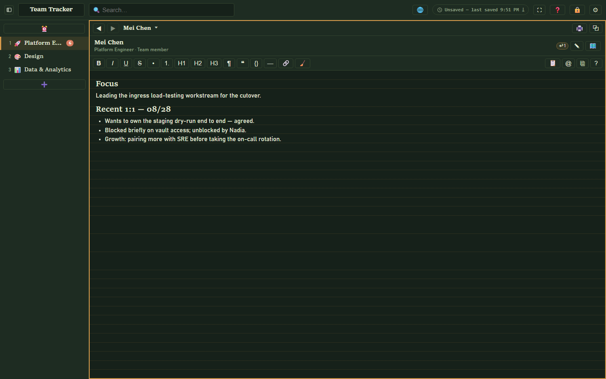
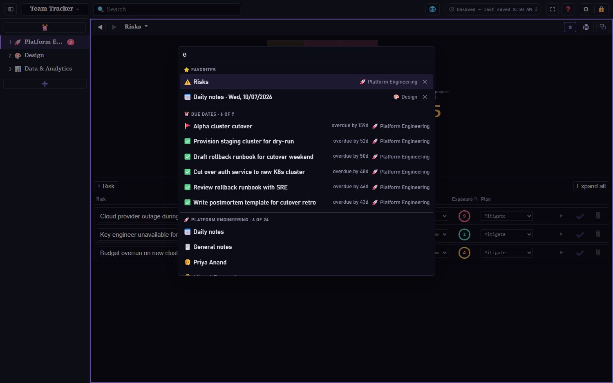
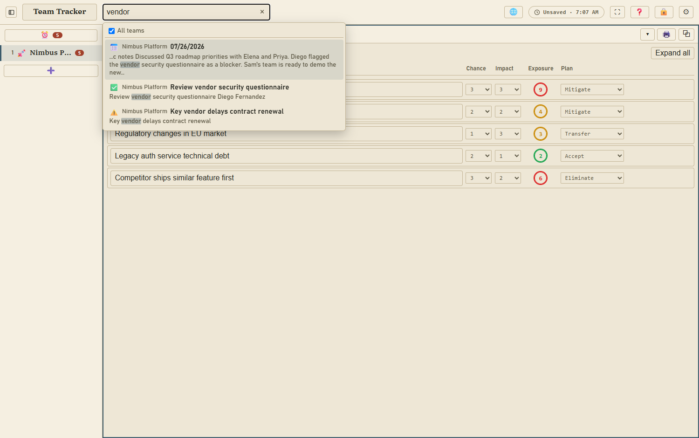

# Team Tracker

A zero-runtime-dependency, single-file web app for tracking teams: people and
hierarchy, daily/per-person notes, action items, milestones (with a calendar
view), and risks.

**[Try it now](https://fmpallini.github.io/team-tracker/)** — runs entirely in
your browser, nothing to install.

### A one-minute tour

Re-organise an org chart by drag, double-click a person to open their notes,
write rich text with shortcuts or markdown, switch between fully separate
teams, jump to any module, item or favorite in any team with Fast Switch
(`Ctrl+Shift+K`), follow `@`-references
(plain click jumps to the item, `Ctrl`+click opens it in the second pane),
drop in one-key templates, run a kanban board with custom columns, drag a risk
on the chance × impact chart to re-score it, and switch to dark mode.



[▶ Watch with sound](https://github.com/fmpallini/team-tracker/blob/main/docs/videos/feature-tour-short.webm)
(the GIF is silent; GitHub can't embed `<video>` in a README, so this link
opens the same clip in its own player).

<details>
<summary>More screenshots</summary>

| | |
|---|---|
|  |  |
| Daily notes + team hierarchy | Rich text — shortcuts + markdown |
|  |  |
| Action items — kanban with custom columns | Milestones — timeline + list |
|  |  |
| Risks — chance × impact exposure | Per-person notes + backlinks |
|  |  |
| `Ctrl+Shift+K` fast switch | `Ctrl+Shift+F` search across every team |

</details>

## Why

Team Tracker is a personal note-taking app for people who lead several teams
and work on their own: your notes on people, 1:1s, action items, milestones,
and risks, kept private to you. It's deliberately not a collaboration tool —
there's no online sharing and no shared workspace.

It's a free alternative to Notion, Obsidian, or any note-taking app — free as
in price, and free as in freedom: it's AGPL-3.0, and the whole app is a single
HTML file you can read end to end. It doesn't try to match those tools feature
for feature; it does one thing, tracking several teams at once.

Most team-tracking tools require an account, a server, and your data leaving
your machine. Team Tracker doesn't:

- 🔌 **100% offline** — nothing leaves your machine (the one optional
  exception is a [daily update check](#privacy-and-updates)).
- 🗄️ **A single `.tmv` file** you keep wherever you want — copy it, back it up,
  sync it. No vendor stores it for you
  ([details](#your-data)).
- 🔒 **Encrypted by default, optionally not** — AES-256 with your password, or
  a password-less plain-text file if you'd rather skip the overhead.
- 🪶 **Tiny** — the entire app is one HTML file, with no dependencies
  ([why that matters](#zero-runtime-dependencies)).
- ⌨️ **Keyboard-first** — `Ctrl+Shift+K` fast switch, `Ctrl+F` /
  `Ctrl+Shift+F` search, `Alt+1`…`Alt+9` team switching, `Alt+←/→` pane
  history, split-view panes, and shortcuts for every module. Desktop-only by
  design: phones and tablets get a notice instead of the app, since mobile
  browsers lack the File System Access API the open/save flow depends on.
- 🎨 **Yours to tune** — 12 color palettes, light/dark/system theme, 7 font
  stacks, adjustable font size, and pt-BR/en-US locales, all in Settings.

## Getting started

### Web app (installable)

**<https://fmpallini.github.io/team-tracker/>** is always the latest release.
Chrome and Edge offer to install it as a local app with its own window, and it
**updates automatically** whenever a new version is released.

### Local file

Download `team-tracker-X.Y.Z.html` from the
[latest release](https://github.com/fmpallini/team-tracker/releases/latest)
(expand **Assets** at the bottom of the release notes), or build it yourself
— see [CONTRIBUTING.md](CONTRIBUTING.md); it lands in `dist/app.html`. Then
double-click it or open it from your browser's file picker. No install, no
server: the whole app (HTML, CSS, JS) lives in that one file.

To open it in its own app-like window (no address bar or tabs), launch Chrome
with the `--app` flag:

```
chrome --app="file:///C:/path/to/team-tracker.html"
```

Keep the quotes — they protect paths with spaces or special characters. On
Linux, drop the drive letter and use `google-chrome`
(`--app="file:///path/to/team-tracker.html"`); on macOS, use
`open -na "Google Chrome" --args --app="file:///path/to/team-tracker.html"`.
For Edge, swap in `msedge` (`microsoft-edge` on Linux, `"Microsoft Edge"` on
macOS). The app's own help dialog (the help button in the header) shows the
exact command for your browser, ready to copy.

## Your data

All state lives in a single `.tmv` file that you create, open, and save through
the app's own file dialogs (or a download-fallback path in browsers without
File System Access API support). Team Tracker never uploads or syncs it.
**You own the file and are responsible for backing it up** — losing it, or
forgetting its password, means the data is unrecoverable.

**Encryption.** By default the file is AES-256-GCM encrypted, decrypted only on
your device. Alternatively choose "Create without password" at creation, or
Settings → Security → "Migrate to password-less" later; you can set a password
on a password-less file at any time from the same tab. The trade-off: anyone
with access to a password-less file — including a cloud provider's automated
scanning — can read it as plain text.

### Backing up

Team Tracker has no backup service and doesn't need one. Keep your `.tmv` in a
folder synced by any cloud client ([Google Drive for
desktop](https://workspace.google.com/products/drive/#download), OneDrive,
Dropbox) and every save is backed up automatically, with either build:

- **Privacy is preserved** — the file is encrypted before it touches disk, so
  the provider only ever sees ciphertext.
- **Available anywhere** — download it from the provider's web UI on any
  machine and open it with the app.
- **Version history for free** — most providers keep earlier versions of a
  synced file for a while (Google Drive: ~30 days). This is the only way to
  recover an earlier state; the app itself has no undo history.

### Automatic backup file (`.bck`)

A second, independent defense against the file on disk becoming unreadable
(cloud version history covers *losing* the file; this covers *corruption*).
Enable "Maintain automatic backup file (.bck)" in Settings → General. The app
then keeps a `.bck` copy wherever you chose to save it (the picker defaults to
the original's folder), refreshed daily (default) or hourly, and always right
after a password change. It holds the same bytes as the primary file. To
recover, rename it from `.bck` to `.tmv` and open it normally.

The save indicator shows a small marker naming your cadence ("Daily backup
enabled", "Hourly backup enabled"). If backup needs attention — lost
permission, a failed write, or a backup still under an old password — it names
the problem instead, independently of whether the primary file is saving fine.

## Privacy and updates

No analytics, no telemetry, ever. The app makes exactly one network call, in
both build variants: once a day it fetches
`https://api.github.com/repos/fmpallini/team-tracker/releases/latest` (a public,
unauthenticated read — nothing about you or your data is sent) and shows a
banner if a newer version is out. It's purely informational; the app never
downloads or installs anything by itself.

- **Web app**: the banner offers "Reload now", which has the already-updated
  service worker take over.
- **Local file**: a static `file://` page can't self-update, so the banner
  links to the releases page for you to download the new file.

Dismissing the banner silences it for that version. There's no preference to
turn the check off entirely.

## Zero runtime dependencies

The app ships as one HTML file with CSS and JS inlined — open it years from
now, on any machine, with any browser, and it still works exactly as built.
That only holds if nothing at runtime depends on a third-party library that
could have a vulnerability, an abandoned maintainer, or a breaking major
version. `esbuild`, `typescript`, `vitest`, `jsdom`, and `@playwright/test` are
dev-only tooling; none of their code ships in the build. It's a hard project
constraint: no runtime dependency is ever added, however small.

It also shrinks the supply-chain attack surface to what's in the build output,
which you can read end to end. Every release is also signed with a build
provenance attestation — see [Verifying a release](docs/VERIFYING.md).

## FAQ

**Where do notes or action items go if they aren't about one specific team?**
Every module is scoped to a team. For org-wide stuff, make a dedicated team —
e.g. `🌐 General` or `🔗 Cross-team` — and use its General Notes / action items.
Global search (`Ctrl+F`, or all teams with `Ctrl+Shift+F`) finds it alongside
everything else.

**Can I use this for just myself, not an actual "team"?**
Yes. A "team" is just a grouping — one person, one project, one client,
whatever's useful. Nothing about the app assumes multiple people.

**How many teams can I have?**
No hard limit. `Alt+1`…`Alt+9` quick-switches the first nine; beyond that, use
the sidebar.

**Can multiple people edit the same file, or can I use it across devices?**
Not simultaneously — it's one manager's tracking tool, not a shared workspace.
In the same browser, a second tab (or the installed app next to a browser tab)
is automatically read-only with a "take control" button. Across browsers or
computers (say, a synced copy on Google Drive), the app checks at save time: if
the file changed elsewhere since you opened it, you choose between reloading
the newer version and saving yours over it. Across desktops, copy the `.tmv`
yourself or use a cloud-synced folder — there's no live sync. Phones aren't
supported (see [Why](#why)).

**What happens if I forget my password?**
No recovery: the key is derived from the password, and nobody (including the
app's author) can decrypt the file without it. Use a password manager.

**How secure is the encryption — could someone brute-force my password?**
Keys come from PBKDF2-SHA256 at 600,000 iterations, deliberately expensive so
guessing against a stolen file is slow even on dedicated hardware. The real
variable is your password: 10+ characters (mixed case, numbers, symbols; not a
dictionary word or a reused password) would take a regular computer far longer
than a human lifetime. Short or common passwords are much weaker. Since there's
no "forgot password" recovery, generate and store it in a password manager.

**Can I import an org chart from a CSV or HR system?**
No bulk import. The only import/export is team-to-team: export a team's
people/hierarchy (no notes, action items, milestones, or risks) so a teammate
can import it — see the Data tab in preferences.

**Does it send reminders or notifications for due dates?**
No push or email. Due/overdue items only show up (sidebar badge, kanban
highlighting) while the app is open.

**Is the "clean up" button in preferences safe to click?**
It's irreversible and deliberately cross-team: it permanently deletes every
done/cancelled action item, completed milestone, closed risk, and daily note
older than the day count you set, across **all** teams in the file. It shows
the exact counts before you confirm — read them first.

## Contributing

- Build & local development — **[CONTRIBUTING.md](CONTRIBUTING.md)**
- How the code is organised — **[docs/ARCHITECTURE.md](docs/ARCHITECTURE.md)**
- Adding a new module/pane — [CONTRIBUTING.md § Adding a new module/pane](CONTRIBUTING.md#adding-a-new-modulepane)
- What changed in each version — [CHANGELOG.md](CHANGELOG.md)
- Local git hooks and the checks CI runs — [.githooks/README.md](.githooks/README.md)
- Checking that a release was built by this repo's workflow — [docs/VERIFYING.md](docs/VERIFYING.md)

## License

AGPL-3.0. See [LICENSE](LICENSE).
